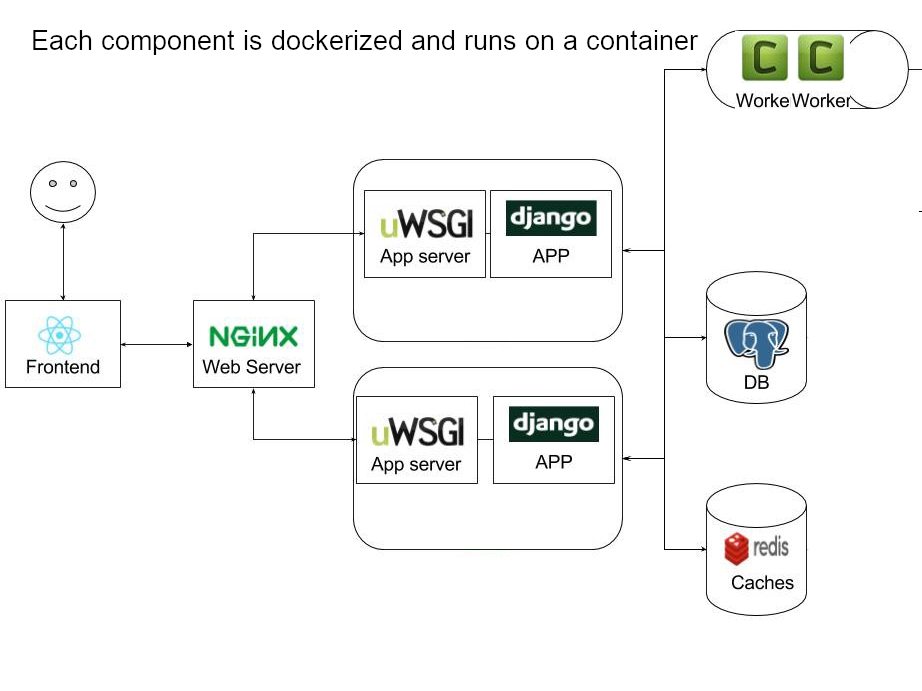
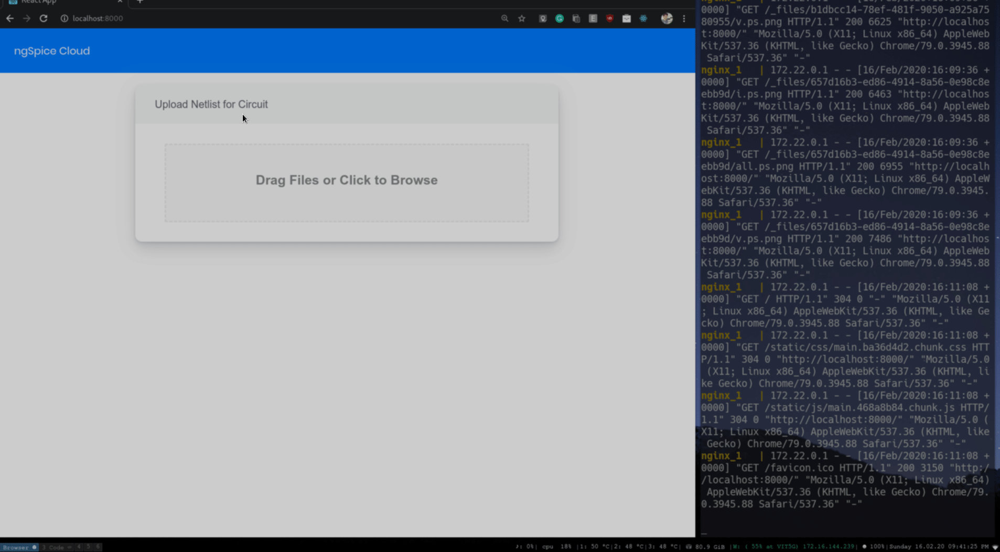
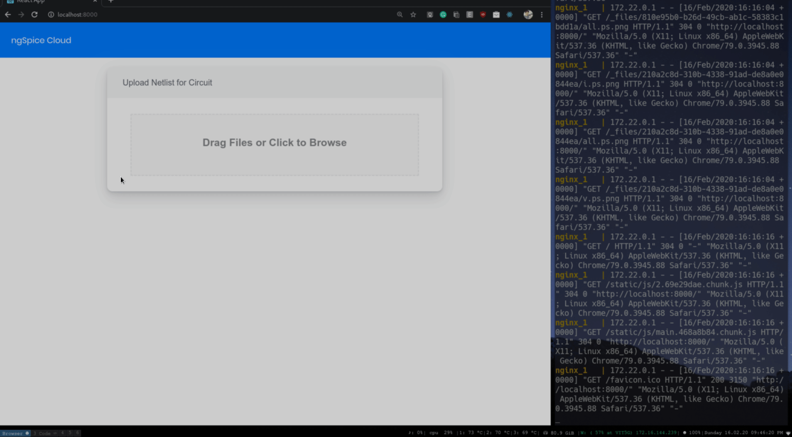
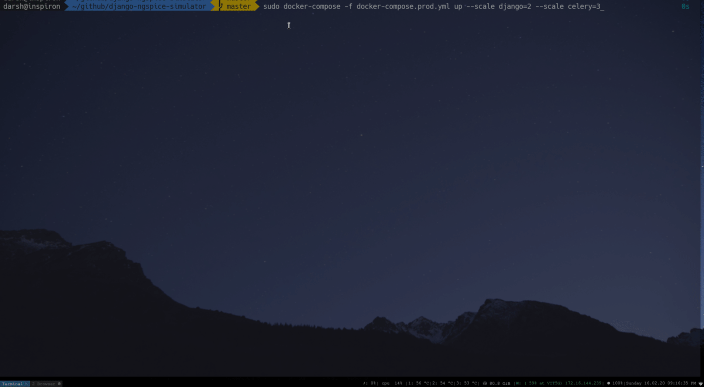
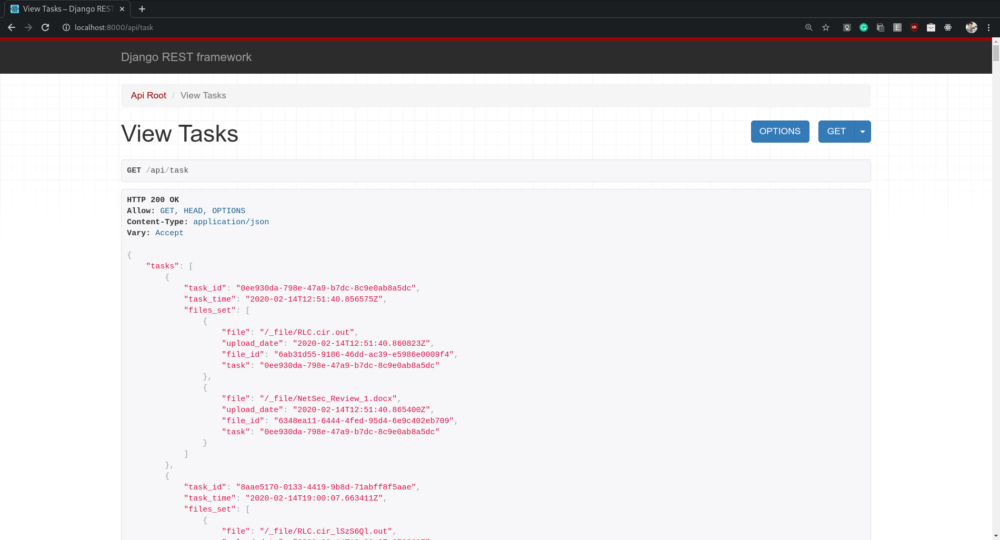
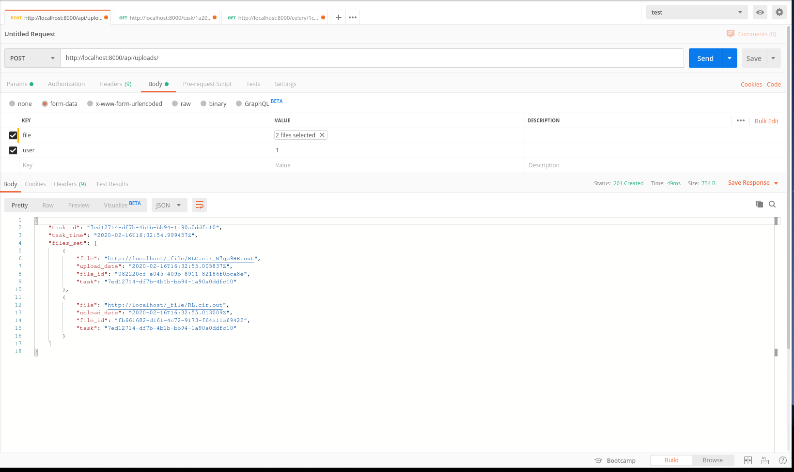
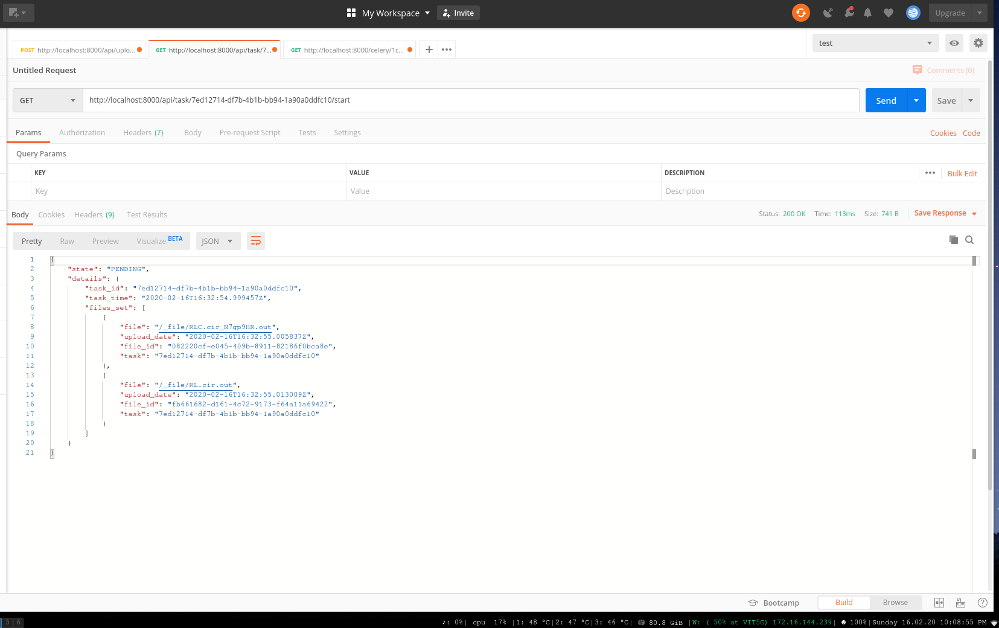
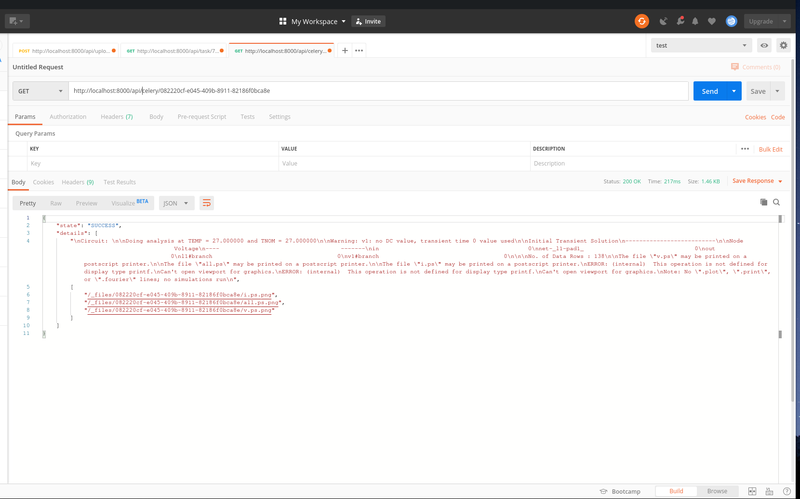

# django-ngspice-simulator
[](https://github.com/darshkpatel/django-ngspice-simulator/actions)
[](https://github.com/darshkpatel/django-ngspice-simulator/actions)

### Technologies
* ReactJS ( Frontend )
* Django ( Backend Framework )
* Postgress ( Database )
* Redis ( Cache )
* Nginx ( Reverse Proxy )
* Celery ( Background Tasks )
* gunicorn ( Backend Server )
* React Shards ( UI Library )
* docker-compose (Container Orchestration)

### Architecture


## Demo

One can Drag&Drop or Upload multiple files using the upload box.
Each file has upload progress bar shown, stores the files on server giving them a UID and associating them with a task.

Clicking submit starts processing the files and progress state of each file is displayed in the associated card which polls the backend for celery task status.

It Shows necessary plots and also ngspice output after file is processed. Once the files are processed Show output button is visible.
#### Basic Demo

A set of netlist files are being uplaoded which, pressing submit triggers processing the files, once they're processed by celery worker show output button is visible showing user the ngspice output and graphs.

#### Session Storage Demo

Session is maintained for the user , which means once the files are uploaded the user can come back and view the final results later.

#### Docker Containers


Any number of celery worker instances can be spawned with each celery worker having concurrency 10 making it highly scalable. Redis is used as a cache for celery.

Django endpoints are served by gunicorn with 2 instances of it running multiple workers for scalability.

Nginx reverse proxy is used to bind backend and frontend routes and also load balancing.


## Features

* Containerized services
* Stores Session of users, thus one can upload files and come back later to see results.
* Load balanced backend(nginx), Scalable multithreaded workers (celery , docker-compose)
* REST API using Django Rest Framework for intuitive endpoint documentation.
* Github Actions Used for CI Testing.
* Intuitive drag and drop file upload with progress bars.

## Execution Instructions
1. Clone the repo and install docker-compose and docker
2. ```sudo docker-compose -f docker-compose.prod.yml build``` this builds necessary docker containers. (It'll take a while, grab some coffee :D)

* To create necessary tables in the DB and generate static files and build  run the following commands( need to be run only once during the initial execution)
3. ``` sudo docker-compose -f docker-compose.prod.yml run --rm django ./manage.py collectstatic --noinput ```
4. ``` sudo docker-compose -f docker-compose.prod.yml run --rm django ./manage.py migrate --noinput ```

* To finally run the servers use the following command, you can modify the scale parameters to create more containers for load balancing.
5.  ``` sudo docker-compose -f docker-compose.prod.yml up --scale django=2 --scale celery=3```

6. Browse to ```http://localhost:8000```

## Alternate execution instructions
```
chmod +x first_run.sh && ./first_run.sh
 ```
### Backend Endpoint Screenshots
Django rest framework endpoints for easy documentation and use


Step 1: Uploading files , returns file uid's and taskid

Step 2: Start given task using endpoint to process files

Step 3: Check Celery task status and output if completed

